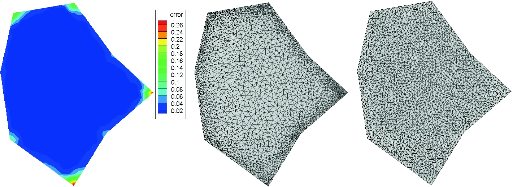
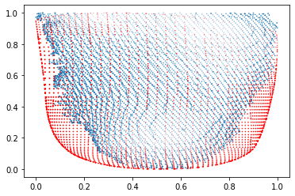
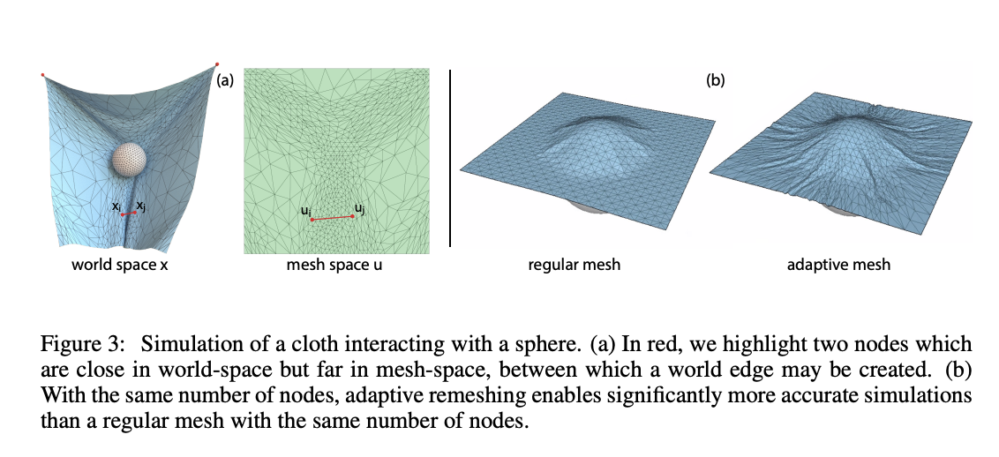
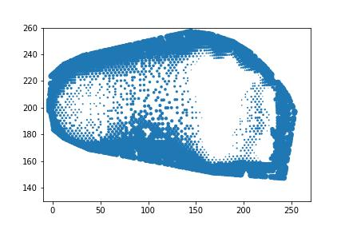
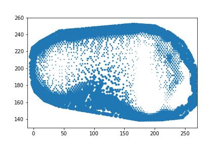
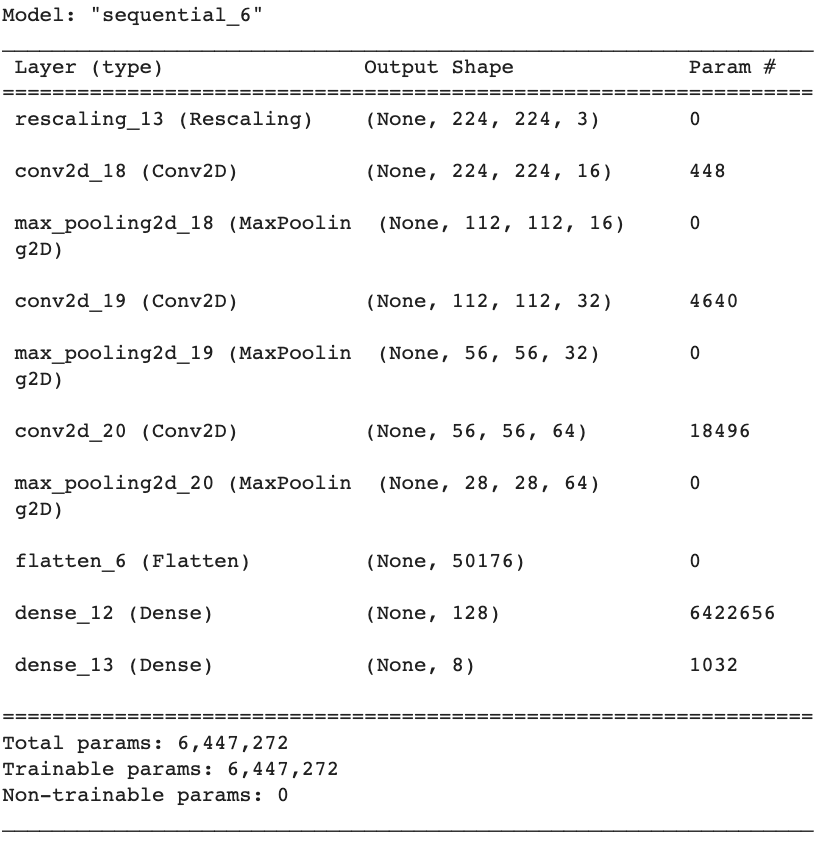
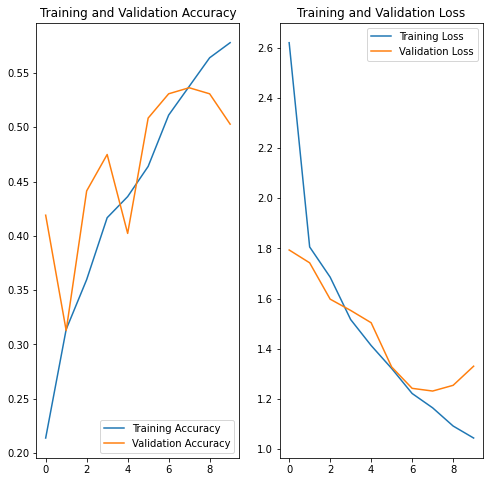

**Create by:** Jana Osea

**Supervised by:** Nick Wilkinson

**Project Duration:** May 2, 20220-August 26, 2022

*Note*: In collaboration with the University of British Columbia Co-op Program and Two Tall Totem Studios


```{r echo=FALSE}
knitr::opts_chunk$set(fig.align="center")
```

```{python echo=FALSE}
import numpy as np
import pandas as pd
import plotly.graph_objects as go
import matplotlib.pyplot as plt
import seaborn as sns
import trimesh

from random import sample, seed

def get_vertices(mesh):
    """ 
    Returns Pandas DataFrame of Vertices from a mesh
    """
    vert = pd.DataFrame(mesh.vertices)
    vert.columns = ['x', 'y', 'z']
    return vert

def plot_vertices(vert):
    """
    Plots mesh from Pandas DataFrame of vertices
    """
    return go.Figure(data=[go.Mesh3d(x=vert.iloc[:,0], y=vert.iloc[:,1], z=vert.iloc[:,2], showscale=True)])

def flatten(list):
    """"
    Flattens a list of lists
    """
    return [item for sublist in list for item in sublist]
```

Below is a background of the objective of this project as well as description of the methods used to analyze the data.

## Table of Contents

[0. Summary and Problem Description](#0-summary-and-problem-description)

[1. Exploratory Data Analysis](#1-exploratory-data-analysis)

[2. Review of Current Methods Used for 3D Predictions](#2-review-of-current-methods-used-for-3d-prediction)

[3. Methods Used for Constrained Model 3D Prediction](#3-methods-used-for-constrained-model-3d-prediction)

[4. Results](#4-results)

[5. Conclusion, Limitations, and Future Work](#5-conclusion-limitations-and-future-work)

[6. References](#6-references)

## 0 Summary and Problem Description

### 0.1 Summary 

As of current, deep learning has been widely used in 2D image data and has significantly improved image recognition. However, learning methods to predict objects in the 3D spaces is still in its infancy and is rapidly growing. The main objective of this project is to explore novel methods to predict the 3D shape of a shell given a 3D input of a foot. Aside from being a useful application for custom orthotic prediction, this project is also unique because 3D object prediction is a new and exciting field in machine learning. 

After careful consideration of various machine learning methods, we conclude that a Convolution Neural Network (CNN) is an effective method to predict a shell output for a corresponding cleaned foot input. Each foot triangular mesh is processed into 2D images and laebelled into 8 categories (wide or narrow width, long or short length, or low or high arch). The 2 CNN model achieves an accuracy of 0.71 for both the right and left foot correspondingly. Post processing after classification produces a general rendering of a sample shell related to the predicted label.


### 0.2 Problem Description

The main objective is to explore novel methods to predict the 3D shape of a shell given a 3D input of a foot. This is a supervised machine learning problem that uses cleaned foot scans and corresponding shell scans to train a model to predict a shell given a cleaned foot scan input.

## 1 Exploratory Data Analysis

### 1.1 Data Description

There are 2 main data sources *Direct Mill* and *Direct Mill 2* which both contain raw foot scans, cleaned foot scans, and predicted shells. *Direct Mill* and *Direct Mill 2* has 899 and 817 foot scans with corresponding bottom and top shells. Below is a list of the missing data in each corresponding category.

Direct Mill:

-   Right foot clean scan: 22
-   Right foot bottom shell: 0
-   Right foot top shell: 0
-   Left foot clean scan: 6
-   Left foot bottom shell: 0
-   Left foot top shell: 0

Direct Mill 2:

-   Right foot clean scan: 0
-   Right foot bottom shell: 0
-   Right foot top shell: 0
-   Left foot clean scan: 0
-   Left foot bottom shell: 0
-   Left foot top shell: 0

There is also additional data through tabular data called *Order form details - Direct mill* that provides information about weight of patient, shell material, shell length, and heel depth cut.

### 1.2 Analysis of Number of Vertices

Prior to creating the models to predict the shells, we first explore the number of vertices across all the shells and see how it relates to the number of vertices in the corresponding cleaned foot scans.

We find that the number of vertices is not the same across the shells. For example, the plot below shows the number of vertices for the right bottom shells from *Direct Mill*. This is the similar result we see for left top shells from both data mills.

```{python echo=F}
shell_meshes = []
shell_verts = []
shell_id = []


# load all the shells and vertices
with open("./data/Direct Mill/Case List.txt") as f:
    for line in f:
        left_shell_mesh = trimesh.load_mesh("./data/Direct Mill/Finished Shells/FinishedShell"+ line.strip() + "_RightBottom.stl")
        left_shell_vert = get_vertices(left_shell_mesh)
        shell_id.append([int(line.strip())]*len(left_shell_vert))
        shell_meshes.append(left_shell_mesh)
        shell_verts.append(left_shell_vert)

f.close()

xs = flatten([i['x'] for i in shell_verts])
ys = flatten([i['y'] for i in shell_verts])
zs = flatten([i['z'] for i in shell_verts])
id = flatten(shell_id)

# create data frame that has ids and all the vertices
all_verts = pd.DataFrame({'id': id, 'xs': xs, 'ys': ys, 'zs': zs})

# create data frame that contains unique id and number of vertices each 
n_vert = all_verts.groupby('id').count()['xs'].tolist()
df_verts = pd.DataFrame({'id':np.unique(id).tolist(), 'n_vertices': n_vert})

order = pd.read_csv('./data/Order form details - Direct Mill.csv')

# merge order mill and vertices and number of vertices
df = pd.merge(order, df_verts, how='left', left_on='Order ID', right_on='id')

df_new = df[(df['n_vertices'] > 54) & (df['n_vertices'] < 5972)]

sns.distplot(df_new['n_vertices'])
```

Next, we explore if there are factors found in the data that explains the different number of shell vertices. We use *Direct Mill* right bottom shell for the number of shell vertices and use *Order form detail* for the additional tabular data.

We see that the type of orthotic does not have a significant effect on the mean number of vertices of the shell as shown below.

```{python echo=F}
# get summary statistics of number of vertices by orthotic type 
desc = df_new[['Orthotic Name', 'n_vertices']].groupby('Orthotic Name').describe()
desc.columns = desc.columns.droplevel()

plt.barh(desc.index, desc['mean'])
plt.title('Mean Number of Vertices By Orthotic Name')
```

In addition, the support rating also does not have a significant effect on the mean number of vertices. Furthermore, both of these variables (orthotic type and support rating) statistically tested insignificant as variables that affect the number of vertices.

```{python echo=FALSE}
desc_supp = df[['Support Rating', 'n_vertices']].groupby('Support Rating').describe()
desc_supp.columns = desc_supp.columns.droplevel()

plt.barh(desc_supp.index, desc_supp['mean'])
plt.title('Mean Number of Vertices By Support Rating')
```

After exploring additional variables in *Order form*, we find that there are no variables that significantly affect the number of shell vertices. This indicates that the tabular data does not provide information that can be used in the predictive model.

### 1.3 Exploring Number of Vertices Between Foot Versus Shell

We use *Direct Mill* right foot clean scan and right bottom shell. The number of vertices for the right foot clean scan is quite different compared to the right bottom shell as compared to the figure in section 1.2.

```{python echo=FALSE}
foot_meshes = []
foot_verts = []
foot_id = []


# load all the shells and vertices
with open("./data/Direct Mill/Case List.txt") as f:
    i = 0
    for line in f:
        try:
            right_foot_mesh = trimesh.load_mesh("./data/Direct Mill/Cut Scans/CutScan"+ line.strip() + "R.stl")
            right_foot_vert = get_vertices(right_foot_mesh)
            foot_id.append([int(line.strip())]*len(right_foot_vert))
            foot_meshes.append(right_foot_mesh)
            foot_verts.append(right_foot_vert)
        except ValueError:
            i+=1
            # print(str(i)+" "+line.strip())

f.close()

xs = flatten([i['x'] for i in foot_verts])
ys = flatten([i['y'] for i in foot_verts])
zs = flatten([i['z'] for i in foot_verts])
id = flatten(foot_id)

# create data frame that has ids and all the vertices
all_foot_verts = pd.DataFrame({'id': id, 'xs': xs, 'ys': ys, 'zs': zs})

# create data frame for just the id and the number of foot vertices  
n_vertices = [len(i) for i in foot_verts]
id = [i[1] for i in foot_id]
df_foot_verts = pd.DataFrame({"id": id, "n_vertices": n_vertices})

# calculate maximum and minimum of each xyz coordinate for the shell
max_shell_verts = all_verts.groupby('id').max().rename(columns={'xs': 'xs_max', 'ys': 'ys_max', 'zs': 'zs_max'})
min_shell_verts = all_verts.groupby('id').min().rename(columns={'xs': 'xs_min', 'ys': 'ys_min', 'zs': 'zs_min'})


# filter xyz coordinates of feet within shell xyz coordinates
temp = pd.merge(all_foot_verts, max_shell_verts, how='left', on='id')
temp = pd.merge(temp, min_shell_verts, how='left', on='id')
temp1 = temp[(temp['xs'] >= temp['xs_min']) & (temp['xs'] <= temp['xs_max'])]
temp2 = temp1[(temp1['ys'] >= temp1['ys_min']) & (temp1['ys'] <= temp1['ys_max'])]
temp3 = temp2[(temp2['zs'] >= temp2['ys_min']) & (temp2['ys'] <= temp2['ys_max'])]

# find new number of vertices that are within shell xyz coordinates
df_foot_verts['n_vertices_foot_filt'] = temp3.groupby('id').count()['xs'].tolist()

sns.distplot(df_foot_verts['n_vertices'])
```

After filtering the cleaned foot scans to only the sections of the foot needed for shell, we find that there are more shells that are less dense than the corresponding foot scan as shown below.

```{python echo=FALSE}
import pandas as pd
# merge order mill and vertices and number of vertices and rename to appropriate column names
df_foot = pd.merge(df, df_foot_verts, how='right', left_on='Order ID', right_on='id')
df_foot = df_foot.rename(columns={'n_vertices_x': 'n_vertices_shell', 'n_vertices_y': 'n_vertices_foot'})

df_foot['diff1'] = df_foot['n_vertices_shell'] - df_foot['n_vertices_foot']

df_foot['diff_cat1'] = np.select(
    [(df_foot['diff1'] < 0),(df_foot['diff1'] > 0)],
    ['Shell is less dense', 'Shell is more dense']
)
df_foot.groupby('diff_cat1').count()['Order ID']
```

We conclude that the model we create must be able to adapt to the different number of vertices both for the cleaned foot scan and the shells. For more details on the exploration of the number of vertices between the foot mesh and the shell mesh, please go to the *eda* folder in *src*.

## 2 Review of Current Methods Used for 3D Prediction

As of current, deep learning has been widely used in 2D images and has significantly improved image recognition. This project is unique because 3D object prediction is an exciting field of machine learning that is in its infancy and is rapidly growing. Below is a review of the current packages that uses 3D objects as input and the corresponding machine learning usages. In addition, below also contains literature that explores methods applied to 3D object inputs.

### 2.1 PyTorch3D

[pytorch3d](https://pytorch3d.readthedocs.io/en/latest/)

PyTorch3D is a Python package that provides efficient tools that allow for 3D object research with [PyTorch](https://pytorch.org/). The main features allows for

-   data storing as triangular meshes
-   operations on triangular meshes (loss functions, sampling)
-   mesh rendering with textures

This package is helpful in that it allows for easy handling of 3D mesh objects. However,the input file must be of .obj type which is a disadvantage since our files are of .stl type.

In addition, although this package allows for interactivity with PyTorch, it does not provide method solution for our main objective. The closest feature would be the application of the loss function, but that only allows for deformation of 3D objects into another 3D object as shown below. It does not provide a prediction method that takes 3D input into 3D output.


[Source](https://pytorch3d.readthedocs.io/en/latest/overview.html)

### 2.2 MeshCNN

[meshcnn](https://ranahanocka.github.io/MeshCNN/)

MeshCNN is a Python package that takes polygonal meshes as input and uses a convolutional neural network that allows for pooling of edges and faces within existing 3D meshes. This allows for dense 3D objects to collapse to a less dense 3D object that still contains most of the information from the previous 3D object.


[Source](ranahanocka.github.io/MeshCNN/)

Given segmentation information on the 3D object, once MeshCNN is trained, the model is able to classify areas within the 3D object input.


[Source](ranahanocka.github.io/MeshCNN/)

This package however does not provide a direct solution to our main objective which is to create a model that takes 3D input and outputs a 3D object. Its main features allow for 3D object pooling and segmentation.

### 2.3 MeshingNet

[MeshingNet](https://link.springer.com/chapter/10.1007/978-3-030-50420-5_14)

This is a research paper that proposes a Deeper Neural Network (DNN), called MeshingNet, to predict meshes given a 2D heat map. This is a useful method that uses non-uniform mesh generation that allows for more 3D output given heatmaps as shown how MeshingNet (left) is more accurate than Triangle (right) below.



[Source](https://link.springer.com/chapter/10.1007/978-3-030-50420-5_14)

Although this method is novel and extremely useful in mesh generation, it does not provide the exact model solution we need. It takes in a 2D input and uses a trained model to generate a mesh. We need the input to be 3D and in addition, the model must be trained not just to make a 1-for-1 mesh generation of the input. The model must be able to predict a viable shell as trained by the 3D input of the foot and 3D output of the scan.

## 3 Methods Used for Constrained Model 3D Prediction

To recap, the main objective is to train a model to predict a shell given a cleaned foot scan input.

#### 3.1 Simple Linear Regression

**Method:** This is the simplest method that selects only 300 vertices from the cleaned foot scan input and the corresponding vertices from the predicted shell. These 300 vertices remains the same throughout each foot. When these 300 vertices from each foot and corresponding shells have been selected for all the 899 feet, a simple linear regression model is trained for each vertex. Hence, we have 300 simple linear regression models each trained with 899 data points. 

When we want to predict a shell for a cleaned foot scan input, we select the 300 vertices and use it as input into the corresponding linear regression models.

**Limitation:** The main issue is that there are many vertices in certain critical points on the shell that do not have a corresponding vertex in the input clean foot scan. In the figure below, the blue dots represent the input foot scan and the red dots represent the corresponding predicted shell. There are many points especially near the exterior area that do not have a corresponding input foot vertex. Hence, the model is unable to predict certain critical parts of the shell that is the points near the edges. Hence, this model was not much explored further.



#### 3.2 Graph Neural Network

**Method:** Graph Neural Network (GNN) applied to triangular mesh data is a recent methodology that is explored [here](https://arxiv.org/pdf/2010.03409.pdf). GNN's takes each vertex in a triangular mesh and predicts its new location at a different time point as the triangular mesh interacts with external factors. As shown in the figure below, GNN's can be used to predict the form of a blanket as a ball is applied to it. 




GNN can be used to solve our predict a shell from a clean foot input as we can train a GNN to interpret the input as an initial time point and the predicted shell as the next time point. Each vertex in the input foot scan will have a different predicted location in th predicted shell. 

**Limitation:** GNN requires the same number of vertices in the initial time point and the next time point. In addition, there must be a one-to-one relationship between all the vertices at each time point. The primary limitation of using a GNN for the Kintec data is that it is difficult to optimally create a one-to-one relationship between the input foot scan and the corresponding predicted shell for each foot. As explored in section [1.3 Exploring Number of Vertices Between Foot Versus Shell](#13-exploring-number-of-vertices-between-foot-versus-shell), the differences of the number of vertices for each input foot scans and predicted shell vary considerably between each foot. In addition, after visually examining multiple foot scans and corresponding predicted shells, it is difficult to determine exactly which input foot vertex corresponds to which output shell vertex. GNN also requires the same number of input vertices for each foot to be the same which is not the case as shown in section [1.2 Analysis of Number of Vertices](#12-analysis-of-number-of-vertices). 

Hence, although this method provides an interesting way to predict triangular meshes, the Kintec dataset may not be the most appropriate type of data for this methodology. 


#### 3.3 Convolutional Neural Network

**Model:** We use a Convolutional Neural Network (CNN) implemented using [Tensorflow Keras Sequential Model](https://www.tensorflow.org/api_docs/python/tf/keras/Sequential) to classify images of feet into 8 classifications according to whether they have a combination of narrow or wide width, short or long length, or low or high arch. 

*Mesh Processing and Data Loading:* The triangular mesh data is first processed to using [Trimesh](https://trimsh.org/trimesh.html) and [Matplotlib](https://matplotlib.org/) to transform the data into a 2D image as shown below. Each foot was arbitrarily classified as one of the 8 labels according to if the max x, y, z vertex is above or below the 50th quantile. The figure below is a right foot classified with a narrow width, short length, and low arch. 




On the contrary, the figure below is a foot classified with a wide width, long length, and high arch.




After creating the labels for the data and transforming them into 2D images, the images were loaded using  [Tensorflow Util](https://www.tensorflow.org/api_docs/python/tf/keras/utils/image_dataset_from_directory) with a batch size of 32 and image height and width of 224. The dataset was split using a 80-20 split for validation and normalized using a rescaling layer from [0, 255] to [0, 1]. 

Note: For information about the details of epochs and batch sizes, please refer to [this](https://towardsdatascience.com/epoch-vs-iterations-vs-batch-size-4dfb9c7ce9c9) article. 

*Model Creation:* The Keras Sequential model has three convolution blocks [(Conv2D)](https://www.tensorflow.org/api_docs/python/tf/keras/layers/Conv2D) each with a max pooling layer [(MaxPooling2D)](https://www.tensorflow.org/api_docs/python/tf/keras/layers/MaxPool2D). The last layer is a dense fully-connected layer [(Dense)](https://www.tensorflow.org/api_docs/python/tf/keras/layers/Dense) with 128 units that is activated by a ReLU activation function ('relu'). This is a standard approach for most convolutional neural networks. 


The model uses an [Adam] optimizer which is a stochastic gradient descent method along with [sparse categorical cross entropy](https://www.tensorflow.org/api_docs/python/tf/keras/losses/SparseCategoricalCrossentropy) loss function since there are more than 2 categories. The model can be summarized in the figure below.



Once the CNN model is trained, the model is tested with the validation data set. The model predicts a category for each foot input. Post processing would then choose an arbitrary shell triangular mesh that  the most resembles the input foot using a series of functions. 

The CNN method provides the most feasible method to solve the objective. There are 2 CNN models generated, one for each of the top shell prediction for the left and right foot correspondingly. The full implementation of the model can be viewed [here](https://github.com/jfosea/kintec-3/blob/main/src/modelling/model.ipynb). 

Note: For more information about the basics of understanding Convolutional Neural Networks, please refer to [this](https://towardsdatascience.com/the-most-intuitive-and-easiest-guide-for-convolutional-neural-network-3607be47480) article.


## 4 Results

We specifically examine the results from the right foot shell model. Please note that the results are very similar in the model for the left foot shell prediction which will not be examined here due to redudancy (note: the left model results can be viewed [here](https://github.com/jfosea/kintec-3/blob/main/src/modelling/model.ipynb) ). 

The training and validation accuracy and loss can be seen below where the x-axis is each epoch. The margin of accuracy between the training and validation is not significantly different. This is paralleled by the similar margin between training and validation loss as shown in the right figure. The model achieves an accuracy of 0.71 which achieves far better accuracy compared to CNN models with 27 and 12 categories with 0.21 and 0.48 accuracy correspondingly.




## 5 Conclusion, Limitations and Future Work

### 5.1 Conclusion


The main objective is to explore novel methods to predict the 3D shape of a shell given a 3D input of a foot. After careful consideration of various methods to generate models using triangular mesh data, we conclude that using a Convolution Neural Network (CNN) is an effective method to predict a shell output for a corresponding cleaned foot input. Each foot triangular mesh is processed into 2D images and labelled into 8 categories according to the max values of the X, Y, and Z vertices. The 2D images and their corresponding labels are used as input into a CNN with 3 convolution layers each with a corresponding 2D max pooling and a final flattening layer with a RELU activation. The 2 CNN model achieves an accuracy of 0.71 for both the right and left foot correspondingly. Post processing after classification produces a general rendering of a sample shell related to the predicted label.


### 5.2 Limitations and Future Work

Limitations exist in that each foot is categorized into a specific label based on the max values of the X, Y, and Z vertices. There are instances where the foot scans contain noise vertices produced by man-made error or production error and so the max values are not robust to determine the max values of the actual foot. Hence, future work lies in producing a more robust method to label each foot that is not based on absolute max values for each vertex axis. 

Another limitation lies in choosing the shell triangular mesh after the model predicts a label for a corresponding foot input. Due to time constraints, this process is primitive in that it only takes an arbitrary shell from each category. Future work lies in generating a more extensive method to produce a corresponding shell triangular mesh for each label. 
